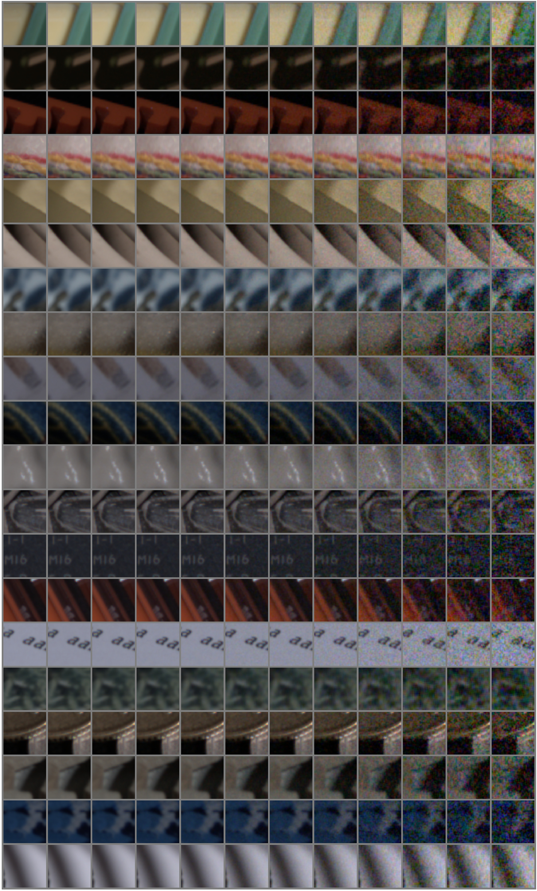
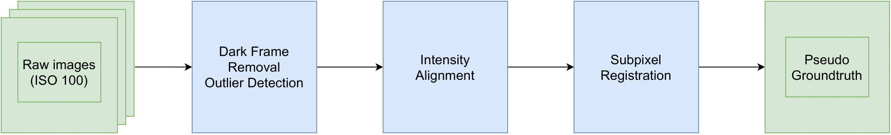

# BVI-LOWLIGHT

BVI-LOWLIGHT is a dataset of images captured in lowlight condtions. The dataset can to be used as a benchmark in image denoising, image quality assesment.

## Description
BVI-LOWLIGHT covers wide range of ISO levels, content and textures. It constitutes 20 scenes captured using 2 cameras (DSLR Nikon D7000 and Sony A7SII) with ISO settings ranging from 100 to 409600. For each combination {scene, camera, ISO} 30 shots were taken.

The images were captured under stable light conditions in a studio (non-flickering LED lights with intensity 2-4 \% and colour temperature 2700K-6500K) with the focus point fixed on the object of interest. A fixed aperture was used with varying shutter speeds.

All images were captured using tripods and remote camera control library [`libgphoto2`](http://www.gphoto.org/proj/libgphoto2) to maximise stabilisation.  

| Cameras                                       | Nikon D7000       | Sony A7SII        |
|-----------------------------------------------|-------------------|-------------------|
| Resolution                                    | 4928x3264         | 4240x2832         |
| Bit depth                                     | 14bit             | 12bit             |
| ISO range                                     | 100--25600        | 100--409600       |
| Aperture                                      | 6.3               | 6.7               |

Each image undergone the process of alignment with the artificially created grountruth "clean" image (see the process of groundtruth estimation below).

Each image is a .tiff file with CFA layout (RGGB pattern) and can be translated into RGB using debayering algorithms. The path to image is `S/C/iso-{I}-shot-{N}-cleaned-aligned.tiff`, where `S` is scene name, `C` is camera name, `I` is ISO level, `N` is number of shot.
 
## How to download

The dataset can be downloaded on [IEEE Dataport](https://ieee-dataport.org/documents/bvi-lowlight). Directory `full_aligned` contains the dataset with full available range of scenes and ISO levels. Each folder containing all images per one scene is put in a separate .zip archive.

## 

